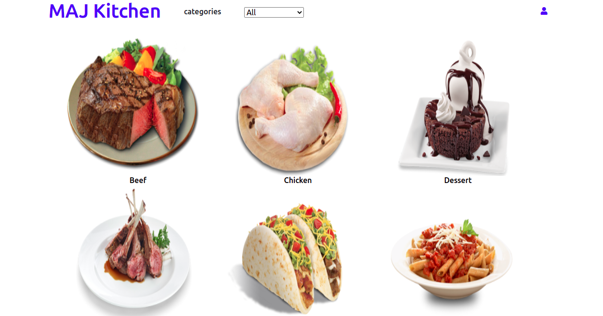

# Food Catalogue

> Food catalogue helps you find different recipe that suits your preferences.



## Built With

- Javascript
- React
- CSS
- Bootstrap
- Redux
- API

## Live Demo

[Live Demo](https://maj-kitchen.netlify.app/)

## Getting Started

To get a local copy up and running follow these simple example steps.

# Instructions (Set Up)

Clone this repository in your computer

```
$ git clone git@github.com:Kingobaino1/food-catalogue-react.js.git
```

To install dependencies, run the code below in terminal

```
$ npm install
```

To see it locally run

```
$ npm start
```

To run test

```
$ npm test
```

Then open localhost:3000 in your web browser.

## Author

👤 **Kingsley Ibeh**

- GitHub: [@githubhandle](https://github.com/Kingobaino1)
- Twitter: [@twitterhandle](https://twitter.com/ibehkingso)
- Linkedin: [@linkedinhandle](https://www.linkedin.com/in/kingsley-ibeh/)

## 🤝 Contributing

Contributions, issues and feature requests are welcome!
Feel free to check the issues page.

## Show your support

Give a ⭐️ if you like this project!

## Acknowledgments

- [Microverse](https://www.microverse.org/).
- [ Nelson Sakwa on Behance](<https://www.behance.net/gallery/31579789/Ballhead-App-(Free-PSDs)>).
- [The Meal Db](https://www.themealdb.com/api.php)

## 📝 License

This project is [MIT licensed](/LICENSE).
